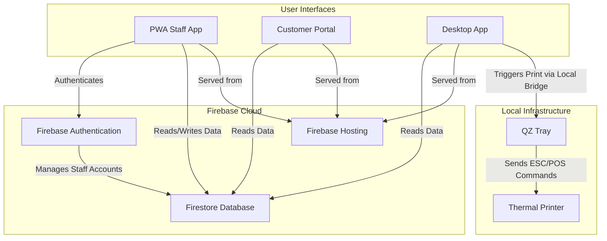
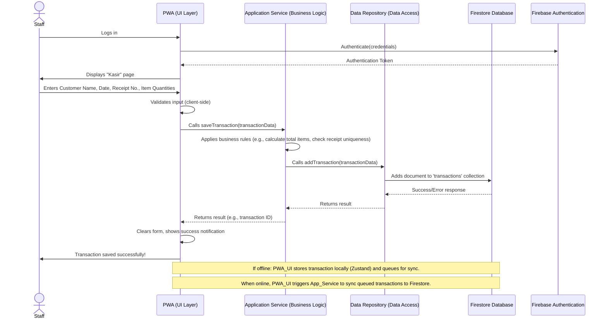

# ARCHITECTURE.md: Laundry Checklist

## System Overview

The Laundry Checklist application employs a modern, serverless architecture centered around Firebase as its backend, serving a Progressive Web App (PWA) for staff, a read-only customer portal, and a web-based desktop application for printing. This approach ensures a single source of truth in Firestore, while adhering to principles of Clean Architecture, Repository Pattern, and Service Layer for robust separation of concerns. User interfaces (PWA, Portal, Desktop) are built with React and TypeScript, interacting with business logic layers that abstract direct database access, promoting maintainability, scalability, and long-term extensibility.

## High-Level Architecture Diagram

## Component Breakdown

### PWA (Staff Application)
The primary interface for laundry staff, built with React, Vite, and TypeScript. It functions as a Progressive Web App, offering offline capabilities for transaction recording and history viewing.
*   **Responsibilities:** User authentication, transaction intake (fixed and dynamic items), history viewing, editing, deleting transactions, managing outlet settings, and offline data queuing/synchronization.
*   **Architecture:** Interacts with a client-side Service Layer which then uses a Repository Layer to communicate with Firestore. UI components do not directly access Firestore.

### Customer Portal
A read-only web application built with React, Vite, and TypeScript, hosted on Firebase Hosting.
*   **Responsibilities:** Allows customers to search for their transaction details using a receipt number and customer name, providing transparency and verification of item counts.
*   **Architecture:** Interacts with a client-side Service Layer and Repository Layer to fetch data from Firestore.

### Desktop Application
A web-based application built with React, Vite, and TypeScript, also hosted on Firebase Hosting.
*   **Responsibilities:** Provides staff with advanced search capabilities for transactions and the ability to print thermal receipts using QZ Tray. It is not the primary input application.
*   **Architecture:** Interacts with a client-side Service Layer and Repository Layer for data access. Communicates with the locally installed QZ Tray application via a WebSocket connection for printing.

### Firebase Firestore
Google's NoSQL cloud database, serving as the single source of truth for all application data.
*   **Responsibilities:** Stores all transaction records, outlet settings, and user profiles. Provides real-time data synchronization and robust security rules for data access control (e.g., outlet-level isolation).
*   **Architecture:** Accessed via the Repository Layer, ensuring all data operations are abstracted and adhere to defined business logic.

### Firebase Authentication
Firebase's managed authentication service.
*   **Responsibilities:** Manages staff user accounts, handles login/logout processes, and provides user identity for Firestore security rules.
*   **Architecture:** Integrated with the PWA for staff login.

### Firebase Hosting
Google's production-grade web content hosting service.
*   **Responsibilities:** Hosts the PWA, Customer Portal, and Desktop Application, providing fast, secure, and reliable content delivery via a global CDN.
*   **Architecture:** Serves all frontend applications, simplifying deployment and infrastructure management.

### QZ Tray
A lightweight, cross-platform client-side application.
*   **Responsibilities:** Acts as a local bridge between the Desktop Application (web-based) and local thermal printers, enabling direct printing of ESC/POS commands.
*   **Architecture:** Installed locally on the desktop machine, it exposes a WebSocket API that the Desktop Application uses to send print jobs.

## Critical Flow Sequence Diagram

This sequence diagram illustrates the most critical user flow: **Staff records a new transaction via the PWA**.

## Deployment Strategy

All web-based applications (PWA, Customer Portal, Desktop App) are deployed to Firebase Hosting. This leverages Firebase's global CDN, automatic SSL, and tight integration with other Firebase services.

*   **PWA (Staff Application):** Deployed to the primary domain or a dedicated subdomain (e.g., `app.laundrychecklist.app`). Configured with a `manifest.json` and service worker for PWA capabilities (offline access, installability).
*   **Customer Portal:** Deployed to a separate subdomain (e.g., `portal.laundrychecklist.app`) on Firebase Hosting.
*   **Desktop Application:** Deployed to another separate subdomain (e.g., `desktop.laundrychecklist.app`) on Firebase Hosting. This is a web application, not an Electron app, and relies on the user having QZ Tray installed locally.
*   **Firebase Backend (Firestore, Authentication):** These are managed services provided by Google Cloud/Firebase and are inherently deployed and scaled within the Firebase infrastructure.
*   **QZ Tray:** This is a client-side application that must be installed manually on each desktop machine requiring printing capabilities. It is not deployed as part of the web application.
*   **Thermal Printer:** A physical peripheral connected to the desktop machine where QZ Tray is installed.