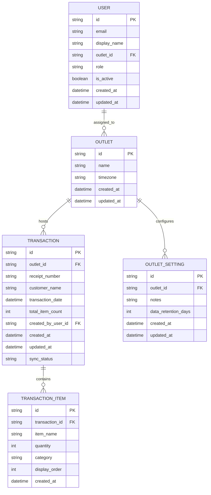

# DATABASE.md: Laundry Checklist

## Entity Relationship Diagram (ERD)



---

## Table Definitions

### OUTLET

**Purpose:** Represents a single laundry service location (branch).

| Column | Type | Constraints | Description |
|:---|:---|:---|:---|
| `id` | String | PK, UUID | Unique outlet identifier |
| `name` | String | NOT NULL, max 100 | Outlet display name (e.g., "Outlet Pusat", "Outlet Cabang Sudirman") |
| `timezone` | String | NOT NULL, default "Asia/Jakarta" | Timezone for transaction date calculations |
| `created_at` | DateTime | NOT NULL, server timestamp | Record creation timestamp |
| `updated_at` | DateTime | NOT NULL, server timestamp | Last modification timestamp |

**Firestore Collection:** `outlets`  
**Document ID:** Auto-generated UUID  
**Indexing:** None required (small collection)

---

### OUTLET_SETTING

**Purpose:** Stores outlet-specific configuration (notes, data retention policy).

| Column | Type | Constraints | Description |
|:---|:---|:---|:---|
| `id` | String | PK, UUID | Unique setting record identifier |
| `outlet_id` | String | FK → OUTLET.id, NOT NULL | Reference to parent outlet |
| `notes` | String | max 500, nullable | Outlet-specific notes/remarks (e.g., "Buka Senin-Jumat 08:00-20:00") |
| `data_retention_days` | Int | default 730 (2 years) | Number of days to retain transaction data before archival |
| `created_at` | DateTime | NOT NULL, server timestamp | Record creation timestamp |
| `updated_at` | DateTime | NOT NULL, server timestamp | Last modification timestamp |

**Firestore Collection:** `outlets/{outlet_id}/settings`  
**Document ID:** Single document per outlet (e.g., `config`)  
**Indexing:** None required (1:1 relationship with outlet)

---

### USER

**Purpose:** Represents staff members with outlet assignment and role-based access.

| Column | Type | Constraints | Description |
|:---|:---|:---|:---|
| `id` | String | PK, Firebase UID | Firebase Authentication user ID |
| `email` | String | UK, NOT NULL, max 255 | Staff email address (unique across system) |
| `display_name` | String | max 100, nullable | Staff full name |
| `outlet_id` | String | FK → OUTLET.id, NOT NULL | Assigned outlet (staff can only access this outlet's transactions) |
| `role` | String | enum: "STAFF", "MANAGER", default "STAFF" | Role determines permissions (MANAGER can edit settings; STAFF can only record/edit transactions) |
| `is_active` | Boolean | default true | Soft-delete flag; inactive users cannot log in |
| `created_at` | DateTime | NOT NULL, server timestamp | Account creation timestamp |
| `updated_at` | DateTime | NOT NULL, server timestamp | Last modification timestamp |

**Firestore Collection:** `users`  
**Document ID:** Firebase UID (matches Firebase Auth)  
**Indexing:** Composite index on `(outlet_id, is_active)` for staff listing per outlet  
**Security Rules:** Users can only read/write their own document; managers can read all users in their outlet

---

### TRANSACTION

**Purpose:** Core entity representing a single laundry intake transaction (receipt).

| Column | Type | Constraints | Description |
|:---|:---|:---|:---|
| `id` | String | PK, UUID | Unique transaction identifier |
| `outlet_id` | String | FK → OUTLET.id, NOT NULL | Outlet where transaction was recorded |
| `receipt_number` | String | UK (per outlet per day), NOT NULL, max 50 | Unique receipt identifier (e.g., "RCP-20240115-001"); uniqueness enforced per outlet per transaction_date |
| `customer_name` | String | NOT NULL, max 100 | Customer name as entered by staff |
| `transaction_date` | DateTime | NOT NULL | Date of intake (used for receipt_number uniqueness scope) |
| `total_item_count` | Int | NOT NULL, computed | Sum of all TRANSACTION_ITEM quantities (auto-calculated, denormalized for query performance) |
| `created_by_user_id` | String | FK → USER.id, NOT NULL | User who created the transaction (audit trail) |
| `created_at` | DateTime | NOT NULL, server timestamp | Record creation timestamp |
| `updated_at` | DateTime | NOT NULL, server timestamp | Last modification timestamp |
| `sync_status` | String | enum: "SYNCED", "PENDING", "FAILED", default "SYNCED" | Offline sync status (PENDING = queued locally; SYNCED = confirmed in Firestore; FAILED = sync error) |

**Firestore Collection:** `outlets/{outlet_id}/transactions`  
**Document ID:** Auto-generated UUID  
**Indexing:**
- Composite index: `(outlet_id, transaction_date DESC)` for history list
- Composite index: `(outlet_id, customer_name)` for customer name search
- Composite index: `(outlet_id, receipt_number)` for receipt number search (unique constraint)

**Unique Constraint:** `(outlet_id, receipt_number, DATE(transaction_date))` — enforced via Firestore security rules + client-side validation + backend trigger

**Notes:**
- `receipt_number` must be unique per outlet per calendar day (not globally unique)
- `total_item_count` is denormalized from TRANSACTION_ITEM for fast aggregation queries
- `sync_status` used by offline-first PWA to track local queue state

---

### TRANSACTION_ITEM

**Purpose:** Individual item line within a transaction (fixed categories + dynamic "Lain-lain" items).

| Column | Type | Constraints | Description |
|:---|:---|:---|:---|
| `id` | String | PK, UUID | Unique item line identifier |
| `transaction_id` | String | FK → TRANSACTION.id, NOT NULL | Parent transaction |
| `item_name` | String | NOT NULL, max 50 | Item name (e.g., "Pakaian", "Celana Dalam", "Sajadah", "Boneka") |
| `quantity` | Int | NOT NULL, range 1–9999 | Item quantity |
| `category` | String | enum: "FIXED", "DYNAMIC", NOT NULL | FIXED = predefined (Pakaian, Celana Dalam, BH, Kaos Kaki); DYNAMIC = user-added (Lain-lain) |
| `display_order` | Int | NOT NULL | Sort order for rendering (fixed items first, then dynamic in insertion order) |
| `created_at` | DateTime | NOT NULL, server timestamp | Record creation timestamp |

**Firestore Collection:** `outlets/{outlet_id}/transactions/{transaction_id}/items`  
**Document ID:** Auto-generated UUID  
**Indexing:** None required (subcollection; queries always scoped to parent transaction)

**Notes:**
- Subcollection design (nested under TRANSACTION) ensures atomic transaction operations
- `category` field allows UI to distinguish fixed vs. dynamic items
- `display_order` ensures consistent rendering order across clients
- No update_at field; items are immutable after creation (edits create new transaction version)

---

## Firestore Collection Structure

```
firestore/
├── outlets/
│   ├── {outlet_id}/
│   │   ├── (document: outlet metadata)
│   │   ├── settings/
│   │   │   └── config (document: outlet settings)
│   │   └── transactions/
│   │       ├── {transaction_id}/
│   │       │   ├── (document: transaction header)
│   │       │   └── items/
│   │       │       ├── {item_id}/ (document: item line)
│   │       │       └── ...
│   │       └── ...
│   └── ...
├── users/
│   ├── {firebase_uid}/ (document: user profile)
│   └── ...
└── audit_logs/ (optional, for future compliance)
    ├── {log_id}/ (document: transaction audit entry)
    └── ...
```

---

## Prisma Schema

```prisma
// Laundry Checklist Database Schema
// Database: Firestore (via Prisma Firestore connector)
// Generated for: Phase 1 PWA + Phase 2 Portal + Phase 3 Desktop

datasource db {
  provider = "firebase"
  url      = env("FIREBASE_DATABASE_URL")
}

generator client {
  provider = "prisma-client-js"
}

// ============================================================================
// OUTLET: Represents a single laundry service location (branch)
// ============================================================================
model Outlet {
  id        String   @id @default(cuid())
  name      String   @db.String(100)
  timezone  String   @default("Asia/Jakarta")
  createdAt DateTime @default(now())
  updatedAt DateTime @updatedAt

  // Relations
  settings     OutletSetting?
  transactions Transaction[]
  users        User[]

  @@map("outlets")
}

// ============================================================================
// OUTLET_SETTING: Outlet-specific configuration (notes, data retention)
// ============================================================================
model OutletSetting {
  id                  String   @id @default(cuid())
  outletId            String   @unique
  notes               String?  @db.String(500)
  dataRetentionDays   Int      @default(730) // 2 years
  createdAt           DateTime @default(now())
  updatedAt           DateTime @updatedAt

  // Relations
  outlet Outlet @relation(fields: [outletId], references: [id], onDelete: Cascade)

  @@map("outlet_settings")
}

// ============================================================================
// USER: Staff members with outlet assignment and role-based access
// ============================================================================
model User {
  id          String   @id // Firebase UID
  email       String   @unique @db.String(255)
  displayName String?  @db.String(100)
  outletId    String
  role        UserRole @default(STAFF)
  isActive    Boolean  @default(true)
  createdAt   DateTime @default(now())
  updatedAt   DateTime @updatedAt

  // Relations
  outlet       Outlet        @relation(fields: [outletId], references: [id], onDelete: Cascade)
  transactions Transaction[]

  @@index([outletId, isActive])
  @@map("users")
}

enum UserRole {
  STAFF
  MANAGER
}

// ============================================================================
// TRANSACTION: Core entity representing a single laundry intake transaction
// ============================================================================
model Transaction {
  id              String   @id @default(cuid())
  outletId        String
  receiptNumber   String   @db.String(50)
  customerName    String   @db.String(100)
  transactionDate DateTime
  totalItemCount  Int      // Denormalized from items; auto-calculated
  createdByUserId String
  createdAt       DateTime @default(now())
  updatedAt       DateTime @updatedAt
  syncStatus      SyncStatus @default(SYNCED)

  // Relations
  outlet Outlet              @relation(fields: [outletId], references: [id], onDelete: Cascade)
  createdBy User             @relation(fields: [createdByUserId], references: [id], onDelete: Restrict)
  items  TransactionItem[]

  // Unique constraint: receipt_number per outlet per day
  // Note: Firestore does not support partial unique indexes.
  // Enforce via security rules + client-side validation + backend trigger.
  // See raw SQL migration below for database-level enforcement.
  @@unique([outletId, receiptNumber, transactionDate])
  @@index([outletId, transactionDate])
  @@index([outletId, customerName])
  @@index([outletId, receiptNumber])
  @@map("transactions")
}

enum SyncStatus {
  SYNCED
  PENDING
  FAILED
}

// ============================================================================
// TRANSACTION_ITEM: Individual item line within a transaction
// ============================================================================
model TransactionItem {
  id              String   @id @default(cuid())
  transactionId   String
  itemName        String   @db.String(50)
  quantity        Int      // Range: 1-9999
  category        ItemCategory
  displayOrder    Int
  createdAt       DateTime @default(now())

  // Relations
  transaction Transaction @relation(fields: [transactionId], references: [id], onDelete: Cascade)

  @@index([transactionId])
  @@map("transaction_items")
}

enum ItemCategory {
  FIXED   // Predefined: Pakaian, Celana Dalam, BH, Kaos Kaki
  DYNAMIC // User-added: Lain-lain items
}
```

---

## Firestore Security Rules

```javascript
// firestore.rules
// Enforce outlet-level isolation, role-based access, and data integrity

rules_version = '2';
service cloud.firestore {
  match /databases/{database}/documents {

    // ========================================================================
    // Helper Functions
    // ========================================================================

    function isAuthenticated() {
      return request.auth != null;
    }

    function getUserOutletId() {
      return get(/databases/$(database)/documents/users/$(request.auth.uid)).data.outletId;
    }

    function getUserRole() {
      return get(/databases/$(database)/documents/users/$(request.auth.uid)).data.role;
    }

    function isStaff() {
      return getUserRole() == 'STAFF';
    }

    function isManager() {
      return getUserRole() == 'MANAGER';
    }

    function isOutletOwner(outletId) {
      return isAuthenticated() && getUserOutletId() == outletId;
    }

    // ========================================================================
    // OUTLETS Collection
    // ========================================================================

    match /outlets/{outletId} {
      // Read: Staff/Manager can read their own outlet
      allow read: if isOutletOwner(outletId);
      
      // Write: Disabled for staff (outlet created by admin via backend)
      allow write: if false;
    }

    // ========================================================================
    // OUTLET_SETTINGS Subcollection
    // ========================================================================

    match /outlets/{outletId}/settings/{document=**} {
      // Read: Staff/Manager can read their own outlet settings
      allow read: if isOutletOwner(outletId);
      
      // Write: Only Manager can update settings
      allow write: if isOutletOwner(outletId) && isManager();
    }

    // ========================================================================
    // TRANSACTIONS Subcollection
    // ========================================================================

    match /outlets/{outletId}/transactions/{transactionId} {
      // Read: Staff/Manager can read transactions from their outlet
      allow read: if isOutletOwner(outletId);
      
      // Create: Staff/Manager can create transactions in their outlet
      allow create: if isOutletOwner(outletId) && 
                       request.resource.data.outletId == outletId &&
                       request.resource.data.createdByUserId == request.auth.uid &&
                       request.resource.data.totalItemCount > 0;
      
      // Update: Staff/Manager can update transactions in their outlet
      allow update: if isOutletOwner(outletId) &&
                       resource.data.outletId == outletId &&
                       request.resource.data.outletId == outletId;
      
      // Delete: Staff/Manager can delete transactions in their outlet
      allow delete: if isOutletOwner(outletId) &&
                       resource.data.outletId == outletId;

      // ====================================================================
      // TRANSACTION_ITEMS Subcollection (nested under transaction)
      // ====================================================================

      match /items/{itemId} {
        // Read: Inherit from parent transaction
        allow read: if isOutletOwner(outletId);
        
        // Create: Allowed when creating transaction
        allow create: if isOutletOwner(outletId);
        
        // Update/Delete: Disabled (items are immutable; edit transaction instead)
        allow update, delete: if false;
      }
    }

    // ========================================================================
    // USERS Collection
    // ========================================================================

    match /users/{userId} {
      // Read: Users can read their own profile; Managers can read users in their outlet
      allow read: if request.auth.uid == userId ||
                     (isManager() && get(/databases/$(database)/documents/users/$(userId)).data.outletId == getUserOutletId());
      
      // Write: Disabled for staff (user created by admin via backend)
      allow write: if false;
    }

    // ========================================================================
    // AUDIT_LOGS Collection (optional, for future compliance)
    // ========================================================================

    match /audit_logs/{logId} {
      // Read: Disabled (audit logs server-side only)
      allow read: if false;
      
      // Write: Server-side only (via backend trigger)
      allow write: if false;
    }

    // ========================================================================
    // Catch-All: Deny all other access
    // ========================================================================

    match /{document=**} {
      allow read, write: if false;
    }
  }
}
```

---

## Firestore Indexes

**Composite Indexes Required:**

| Collection | Fields | Order | Purpose |
|:---|:---|:---|:---|
| `outlets/{outletId}/transactions` | `(transactionDate DESC, createdAt DESC)` | Descending | History list pagination (newest first) |
| `outlets/{outletId}/transactions` | `(customerName ASC)` | Ascending | Customer name search |
| `outlets/{outletId}/transactions` | `(receiptNumber ASC)` | Ascending | Receipt number search (unique lookup) |

**Firestore Index Configuration (firestore.indexes.json):**

```json
{
  "indexes": [
    {
      "collectionGroup": "transactions",
      "queryScope": "Collection",
      "fields": [
        {
          "fieldPath": "transactionDate",
          "order": "DESCENDING"
        },
        {
          "fieldPath": "createdAt",
          "order": "DESCENDING"
        }
      ]
    },
    {
      "collectionGroup": "transactions",
      "queryScope": "Collection",
      "fields": [
        {
          "fieldPath": "customerName",
          "order": "ASCENDING"
        }
      ]
    },
    {
      "collectionGroup": "transactions",
      "queryScope": "Collection",
      "fields": [
        {
          "fieldPath": "receiptNumber",
          "order": "ASCENDING"
        }
      ]
    }
  ]
}
```

---

## Unique Constraint Enforcement

**Problem:** Firestore does not support partial unique indexes (e.g., `@@unique([outletId, receiptNumber], where: [transactionDate == TODAY])`).

**Solution:** Multi-layer enforcement:

1. **Client-Side Validation (PWA):**
   - Before submit, query Firestore for existing receipt numbers on same date + outlet
   - Show error toast if duplicate detected
   - Prevent form submission

2. **Firestore Security Rules:**
   - Validate `receiptNumber` is not empty
   - Validate `totalItemCount > 0`
   - Validate `outletId` matches authenticated user's outlet

3. **Backend Trigger (Cloud Function):**
   - On transaction create/update, query Firestore for duplicates
   - If duplicate found on same date + outlet, reject write with error
   - Log violation to audit trail

**Raw SQL Migration (if using Cloud Firestore with Datastore mode):**

```sql
-- Create unique index for receipt_number per outlet per day
-- Note: Firestore native mode does not support raw SQL.
-- This is for reference if migrating to Datastore mode.

CREATE UNIQUE INDEX idx_receipt_unique
ON transactions (outlet_id, receipt_number, DATE(transaction_date))
WHERE deleted_at IS NULL;
```

---

## Data Retention & Archival Policy

**Default Retention:** 2 years (730 days) per outlet setting  
**Archival Strategy:**
- Transactions older than `dataRetentionDays` are marked as archived (soft-delete via `archivedAt` field)
- Archived transactions excluded from normal queries (add `WHERE archivedAt IS NULL`)
- Archived data retained in Firestore for compliance; not displayed in UI
- Manual export to Cloud Storage before deletion (optional, for audit trail)

**Implementation:**
- Add `archivedAt` field to TRANSACTION model (nullable DateTime)
- Cloud Function scheduled daily to archive old transactions
- Update Firestore security rules to exclude archived transactions from read queries

---

## Offline Sync Strategy

**Offline Queue Storage:** IndexedDB (via Zustand + idb library)

**Queue Schema (IndexedDB):**

```javascript
// offlineQueue table in IndexedDB
{
  id: string (UUID),
  type: 'CREATE' | 'UPDATE' | 'DELETE',
  entityType: 'TRANSACTION',
  payload: {
    outletId: string,
    receiptNumber: string,
    customerName: string,
    transactionDate: ISO8601,
    items: [
      { itemName: string, quantity: number, category: 'FIXED' | 'DYNAMIC', displayOrder: number }
    ]
  },
  timestamp: ISO8601,
  retryCount: number (default 0),
  status: 'PENDING' | 'SYNCED' | 'FAILED'
}
```

**Sync Flow:**

1. **Offline Create:** Transaction saved to IndexedDB queue; UI shows "Syncing..." badge
2. **Online Detection:** Service Worker detects connectivity; triggers sync
3. **Batch Sync:** Dequeue up to 10 transactions; send to Firestore via batch write
4. **Conflict Resolution:** Last-write-wins (server timestamp takes precedence)
5. **Retry Logic:** Failed syncs retry up to 3 times with exponential backoff (1s, 2s, 4s)
6. **User Notification:** Toast shows sync status (success/failure); manual retry button if failed

**Firestore Batch Write Endpoint (Cloud Function):**

```typescript
// functions/syncOfflineQueue.ts
export const syncOfflineQueue = functions.https.onCall(async (data, context) => {
  const { transactions } = data;
  const batch = db.batch();

  for (const tx of transactions) {
    const docRef = db.collection('outlets').doc(tx.outletId)
      .collection('transactions').doc(tx.id);
    batch.set(docRef, tx, { merge: true });
  }

  await batch.commit();
  return { success: true, synced: transactions.length };
});
```

---

## Query Patterns & Performance Optimization

### Query 1: Fetch Transaction History (Paginated)

```typescript
// Get 20 most recent transactions for outlet
const query = db.collection('outlets').doc(outletId)
  .collection('transactions')
  .orderBy('transactionDate', 'desc')
  .orderBy('createdAt', 'desc')
  .limit(20);

const snapshot = await query.get();
```

**Index:** `(transactionDate DESC, createdAt DESC)`  
**Expected Latency:** < 500ms

---

### Query 2: Search by Customer Name

```typescript
// Search transactions by customer name (case-insensitive prefix match)
const query = db.collection('outlets').doc(outletId)
  .collection('transactions')
  .where('customerName', '>=', searchTerm)
  .where('customerName', '<', searchTerm + '\uf8ff')
  .orderBy('customerName')
  .limit(50);

const snapshot = await query.get();
```

**Index:** `(customerName ASC)`  
**Expected Latency:** < 500ms

---

### Query 3: Search by Receipt Number

```typescript
// Exact match lookup by receipt number
const query = db.collection('outlets').doc(outletId)
  .collection('transactions')
  .where('receiptNumber', '==', receiptNumber)
  .limit(1);

const snapshot = await query.get();
```

**Index:** `(receiptNumber ASC)` (or none; single-field queries auto-indexed)  
**Expected Latency:** < 200ms

---

### Query 4: Check Receipt Number Uniqueness (Before Create)

```typescript
// Verify receipt_number is unique for outlet + date
const today = new Date();
today.setHours(0, 0, 0, 0);
const tomorrow = new Date(today);
tomorrow.setDate(tomorrow.getDate() + 1);

const query = db.collection('outlets').doc(outletId)
  .collection('transactions')
  .where('receiptNumber', '==', receiptNumber)
  .where('transactionDate', '>=', today)
  .where('transactionDate', '<', tomorrow)
  .limit(1);

const snapshot = await query.get();
const isDuplicate = snapshot.size > 0;
```

**Indexes:** `(receiptNumber ASC)`, `(transactionDate ASC)`  
**Expected Latency:** < 300ms

---

### Query 5: Fetch Transaction with Items (Detail View)

```typescript
// Get transaction + all items
const txDoc = await db.collection('outlets').doc(outletId)
  .collection('transactions').doc(transactionId).get();

const itemsSnapshot = await db.collection('outlets').doc(outletId)
  .collection('transactions').doc(transactionId)
  .collection('items')
  .orderBy('displayOrder', 'asc')
  .get();

const transaction = txDoc.data();
const items = itemsSnapshot.docs.map(doc => doc.data());
```

**Expected Latency:** < 300ms (2 reads)

---

## Denormalization Strategy

**Denormalized Field:** `TRANSACTION.totalItemCount`

**Rationale:**
- Avoids expensive aggregation queries (sum of all items per transaction)
- Enables fast sorting/filtering by total count
- Reduces read operations on history page

**Maintenance:**
- Calculated on client before write (React Hook Form computed field)
- Validated on server (Cloud Function trigger)
- Updated atomically with transaction write (no separate update)

**Consistency:** Strong (calculated at write time; no async updates)

---

## Backup & Disaster Recovery

**Firestore Automated Backups:**
- Enable daily automated backups via Firebase Console
- Retention: 7 days (configurable)
- Restore point: Any backup within retention window

**Manual Export (Compliance):**
- Monthly export of all transactions to Cloud Storage (gs://laundry-checklist-backups/)
- Format: JSON Lines (one transaction per line)
- Retention: 2 years (matches data retention policy)

**Cloud Function for Scheduled Export:**

```typescript
// functions/exportTransactions.ts
export const exportTransactions = functions.pubsub
  .schedule('0 2 * * *') // Daily at 2 AM
  .timeZone('Asia/Jakarta')
  .onRun(async (context) => {
    const outlets = await db.collection('outlets').get();
    
    for (const outletDoc of outlets.docs) {
      const outletId = outletDoc.id;
      const transactions = await db.collection('outlets').doc(outletId)
        .collection('transactions').get();
      
      const jsonl = transactions.docs
        .map(doc => JSON.stringify(doc.data()))
        .join('\n');
      
      const bucket = admin.storage().bucket();
      const file = bucket.file(`backups/${outletId}/${new Date().toISOString()}.jsonl`);
      await file.save(jsonl);
    }
  });
```

---

## Monitoring & Observability

**Firestore Metrics (Firebase Console):**
- Read/write operations per day
- Storage usage per outlet
- Query latency (p50, p95, p99)
- Index usage

**Application Metrics (Sentry, future):**
- Sync queue depth (pending transactions)
- Sync failure rate
- Offline duration distribution
- Form validation errors

**Alerts:**
- Firestore quota exceeded (80% threshold)
- Sync failure rate > 5%
- Query latency p95 > 1s
- Storage growth > 100 GB/month

---

## Migration & Data Import

**Initial Data Import (if migrating from legacy system):**

1. Export legacy transactions to CSV (receipt_number, customer_name, date, items)
2. Transform CSV to Firestore JSON format
3. Batch import via Cloud Function (max 500 docs per batch)
4. Validate record count matches source
5. Spot-check 10 random transactions for accuracy

**Cloud Function for Batch Import:**

```typescript
// functions/importLegacyData.ts
export const importLegacyData = functions.https.onCall(async (data, context) => {
  const { outletId, transactions } = data;
  const batch = db.batch();
  let count = 0;

  for (const tx of transactions) {
    const docRef = db.collection('outlets').doc(outletId)
      .collection('transactions').doc();
    batch.set(docRef, {
      ...tx,
      createdAt: admin.firestore.FieldValue.serverTimestamp(),
      updatedAt: admin.firestore.FieldValue.serverTimestamp(),
      syncStatus: 'SYNCED'
    });
    count++;

    if (count % 500 === 0) {
      await batch.commit();
      batch = db.batch();
    }
  }

  if (count % 500 !== 0) {
    await batch.commit();
  }

  return { success: true, imported: count };
});
```

---

## Compliance & Data Privacy

**Data Classification:**
- **PII:** Customer name, receipt number (low sensitivity; no email/phone)
- **Operational:** Item counts, dates (internal use only)

**Encryption:**
- **In Transit:** TLS 1.3 (Firebase Hosting + Firestore)
- **At Rest:** Firestore encryption (Google-managed keys)

**Access Control:**
- Outlet-level isolation via Firestore security rules
- Role-based permissions (STAFF vs. MANAGER)
- Audit logs of all writes (via Cloud Function triggers)

**Data Retention:**
- Default: 2 years per outlet setting
- Archived transactions soft-deleted (not displayed in UI)
- Hard deletion after retention period (via scheduled Cloud Function)

**GDPR Compliance (if applicable):**
- Right to deletion: Customer can request deletion of their transactions (manual process via support)
- Data portability: Export transaction data as JSON
- Consent: Implicit via receipt acceptance at intake

---

## Glossary (Database-Specific Terms)

| Term | Definition |
|:---|:---|
| **Outlet** | Single laundry service location; primary data isolation boundary |
| **Transaction** | Single intake event; contains receipt number, customer name, date, items |
| **Receipt Number** | Unique identifier per outlet per day (e.g., "RCP-20240115-001") |
| **Sync Status** | Offline queue state: SYNCED (confirmed in Firestore), PENDING (queued locally), FAILED (sync error) |
| **Denormalization** | Storing computed value (totalItemCount) in document to avoid expensive aggregation queries |
| **Last-Write-Wins** | Conflict resolution: server timestamp determines final state in offline sync |
| **Partial Index** | Unique constraint scoped to specific rows (e.g., receipt_number unique only for today's date) |
| **Subcollection** | Nested Firestore collection under parent document (e.g., items under transaction) |
| **Batch Write** | Atomic multi-document write operation (all succeed or all fail) |

---

**Document Version:** 1.0  
**Last Updated:** [Current Date]  
**Status:** Ready for Phase 1 Development